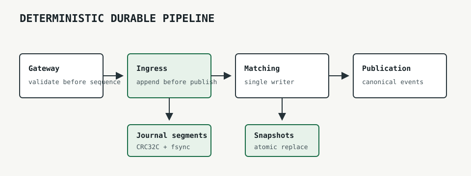
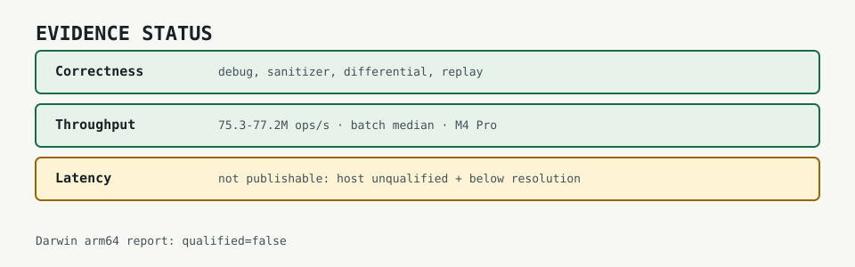

# Low-Latency Order Matching Engine

An open-source C++23 project for studying a small, deterministic, mechanically sympathetic order matching engine.

The thesis is that predictable ownership, bounded work, explicit sequencing, and measurement discipline matter more on the hot path than a large framework stack.

## Current state

The engine provides a fixed-capacity, single-writer order book with generation-checked handles, bounded integer prices, hierarchical price-level occupancy, caller-owned output, and no matching-path allocation after construction.
Supported semantics include GTC, IOC, FOK, market, post-only, trader-based self-trade prevention, iceberg replenishment, stop and stop-limit orders, threshold pro-rata allocation, and an opening cross.

The operational path includes gateway validation, deterministic lane merge, canonical command and market-data protocols, BBO, MBO, and MBP publication, bounded SPSC stages, strict runtime configuration, lifecycle and health reporting, mmap journals, rotation, snapshots, compaction, and deterministic multi-segment replay.
Correctness coverage includes an independent reference book, differential simulation, structural invariants, decoder and operation fuzzing, sanitizer jobs, deterministic fault schedules, crash-window tests, and soak tests.

This remains experimental software.
It is not a deployed exchange service and does not provide networking, authentication, authorization, cryptographic file authentication, replication, regulatory controls, or real-money safeguards.

## Pipeline architecture



Stages do not own threads or waiting policy.
Production code can pin externally owned threads, while deterministic tests control scheduling directly.
Commands become visible to matching only after durable append, and complete event batches become visible to publication before input release.

## Evidence status



The retained [optimization campaign](docs/optimization-campaign.md) compares equivalent price-level indexes and runs full-engine rate sweeps.
All campaign artifacts are explicitly `regression_only`.
The live Darwin arm64 [host report](benchmark-results/phase7-host/mac-arm64.json) is `qualified: false`, and every measured operation is below the harness resolution threshold.
No latency number from the Mac or CI is published or suitable for a resume.

The [artifact manifest](benchmark-results/phase7-comparison/manifest.json) links the source revision, compiler, platform, comparison files, full-engine sweeps, and host report.
Reproduction commands are recorded in the [campaign document](docs/optimization-campaign.md).

## Design alternatives

The production price index remains the dense ladder plus hierarchical bitmap.
Under the retained equivalent workload it led `std::map`, a reserved sorted vector, and pinned Abseil `btree_map` at all three tested active-level sizes with identical checksums.
That result does not claim full-engine latency, but it provides no evidence for replacing the production structure.

Branch hints, transparent huge pages, PGO, and BOLT were not adopted.
They require reproducible qualified full-engine evidence, not a plausible compiler story or one noisy local result.
The detailed decision and rejected hypotheses are in the [comparison guide](docs/benchmark-alternatives.md) and [campaign findings](docs/optimization-campaign.md).

## Design principles

C++23 is the language baseline because this project targets explicit data layout, ownership, allocation, and compile-time constraints while using current standard-library facilities.
The runtime engine is intended to remain dependency-free.
Development-only dependencies must be justified by real code and introduced with the first target that needs them.
The rationale is recorded in [ADR-0001](docs/adr/0001-cpp23-and-dependency-policy.md).

The planned hot path will not use gRPC, dynamic serialization, network RPC, logging, or blocking I/O.
Those tools can be appropriate at process boundaries and on control-plane paths, but their scheduling, allocation, framing, and serialization work conflicts with a deliberately small and measurable matching loop.
Transport adapters may be considered later without becoming part of the matching core.

Measurement rules are defined before publishing numbers in [ADR-0002](docs/adr/0002-measurement-contract.md).
Clock selection and refusal behavior are documented in [the measurement guide](docs/measurement.md) and [ADR-0009](docs/adr/0009-portable-benchmark-clock.md).

## Build

The minimum supported CMake version is 3.22, and presets use Ninja.
A compiler supporting the C++23 features used by the core library is required.

```sh
cmake --preset debug
cmake --build --preset debug
ctest --preset debug
```

Tests use a pinned GoogleTest checkout and are enabled by default only when this repository is the top-level CMake project.
Set either `-DBUILD_TESTING=OFF` or `-DENGINE_BUILD_TESTS=OFF` to configure the dependency-free core without fetching or building tests.
Use `release` in place of `debug` for an optimized build.
The `asan`, `ubsan`, and `tsan` presets enable one sanitizer at a time.
The `fuzz` preset requires an upstream Clang distribution with working libFuzzer and AddressSanitizer runtimes.
On Apple silicon, the preset checks `/opt/homebrew/opt/llvm/bin` before the inherited `PATH` so a Homebrew LLVM installation is selected.
Configuration compiles and links a fuzz harness probe and fails with a precise error when the required runtimes are unavailable.
Under this preset, `engine_configure_target()` uses `fuzzer-no-link`, while an executable fuzz harness must use `engine_configure_fuzz_target()` to link the libFuzzer runtime.
The `measurement` preset builds and tests the separate measurement and benchmark libraries, `clock_probe`, and `order_book_benchmark` in Release mode.
Run `./build/measurement/clock_probe --samples 10000 --calibration-ms 10` to emit the startup self-check JSON.
The JSON separates `clock_safe` from `operation_percentiles_publishable`; a zero exit status does not imply publishable latency evidence.
The [benchmarking guide](docs/benchmarking.md) defines open-loop scheduling, workloads, artifacts, diagnostics, and reproduction commands.
The [host qualification guide](docs/host-qualification.md) defines Linux environment evidence and the CI-only batch throughput gate.
The core target does not link measurement or persistence code, and `ENGINE_BUILD_BENCHMARKS` defaults to `OFF`.
Applications opt into command persistence by linking `matching_engine::persistence`.
The [journaling guide](docs/journaling.md) specifies canonical bytes, append-before-apply ordering, recovery, and durability limits.
The [snapshot and replay guide](docs/snapshots-and-replay.md) specifies snapshot bytes, atomic replacement, restore validation, and verifier behavior.
The [persistence recovery runbook](docs/recovery-runbook.md) specifies crash recovery, rotated replay, writer resume, and compaction handling.
The [runtime configuration guide](docs/runtime-configuration.md) specifies strict startup fields, resource relationships, and API compatibility.
The [runtime operations guide](docs/operations.md) specifies lifecycle, graceful drain, health states, and structured reporting.
The [reliability testing guide](docs/reliability-testing.md) specifies deterministic fault schedules, soak coverage, and model limits.
The [pipeline guide](docs/pipeline.md) specifies SPSC memory ordering, stage ownership, backpressure, poisoning, snapshots, shutdown, and benchmark interpretation.

## Measurement contract

Benchmark artifacts disclose source revision, compiler, hardware, operating system, workload, sample count, warmup, requested rate, completion rate, clock qualification, and operation resolution.
Latency publication requires both a qualified clock and a qualified host report from the same candidate run.
Shared CI and the current Mac are regression environments only.

## Limitations and non-goals

- This is not production-ready trading software.
- Command-journal persistence, rotation, compaction, snapshots, replay verification, gateway risk limits, strict runtime configuration, lifecycle, and health reporting are implemented.
- Networking, authentication, authorization, account controls, cryptographic file authentication, administration services, and real-money safeguards are not implemented.
- Order capacity and price-domain size are each capped at 1,000,000 to bound snapshot files and restore-time memory amplification.
- Exhausted terminal snapshots can be loaded, but the current replay verifier rejects them because a sequence-1 journal cannot prove the `UINT64_MAX` boundary.
- Duplicate order identifiers are not detected by the matching core and are rejected by the gateway boundary.
- Structural invariant checks do not prove volume conservation by themselves; the differential driver checks an independent conservation ledger.
- Each order book requires exclusive access by one matching thread; concurrent calls are unsupported.
- Price and order capacities are fixed at construction, and callers must provide `max_orders` trade slots for every submission.
- Market and IOC residual is cancelled, while FOK rejects without mutation unless the full quantity is immediately executable within its limit.
- Amendments only support retaining or decreasing remaining quantity; any resting replacement receives a new generation and loses queue priority.
- Implemented exchange semantics are limited to the documented post-only, self-trade prevention, iceberg, stop, threshold pro-rata, and opening-cross rules.
- Distributed consensus and replication are not implemented.
- Kernel bypass, FPGA integration, and custom hardware are not current goals.
- The project will not trade correctness or determinism for an attractive benchmark number.

## Project documentation

- [Architecture decision records](docs/adr/README.md)
- [Differential testing and replay](docs/differential-testing.md)
- [Order book fuzzing](docs/fuzzing.md)
- [Measurement clock self-check](docs/measurement.md)
- [Order-book benchmarking methodology](docs/benchmarking.md)
- [Price-level index comparison](docs/benchmark-alternatives.md)
- [Measured optimization campaign](docs/optimization-campaign.md)
- [Linux host qualification and CI throughput gate](docs/host-qualification.md)
- [Deterministic sequencing and command journaling](docs/journaling.md)
- [Versioned snapshots and deterministic replay](docs/snapshots-and-replay.md)
- [Durable three-stage pipeline](docs/pipeline.md)
- [Primary references](docs/references.md)
- [Security policy](SECURITY.md)
- [Threat model](docs/threat-model.md)
- [Resource limits](docs/resource-limits.md)
- [Installation and packaging](docs/packaging.md)

## License

This project is available under the [MIT License](LICENSE).
