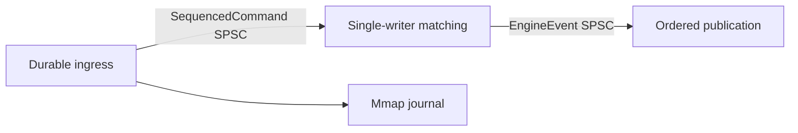

# Low-Latency Order Matching Engine

An open-source C++23 project for studying a small, deterministic, mechanically sympathetic order matching engine.

The thesis is that predictable ownership, bounded work, explicit sequencing, and measurement discipline matter more on the hot path than a large framework stack.

## Status

Phase 1 now includes strong price, quantity, identifier, sequence, side, and handle domain types.
It also includes a fixed-capacity order arena with generation-checked handles and separate hot-order and arena metadata storage.
Prices can be mapped into a validated bounded tick domain, and a fixed hierarchical bitmap tracks populated level indexes.
A single-writer, fixed-capacity order book now matches GTC, IOC, FOK, and market orders with price-time priority, maker-price executions, caller-owned trade output, and no allocation after construction.
Generation-checked cancellation, priority-preserving quantity decreases, and priority-losing cancel-replacement are implemented.
Phase 2A adds an explicit allocation-free structural invariant checker for tests, deterministic replay verification, and debug tooling.
The checker validates redundant level, occupancy, linked-list, arena-liveness, aggregate, reachability, and uncrossed-book representations without running on release order operations.
Phase 2B adds generation-validated live order inspection and an independent standard-library reference book.
Ten fixed seeds exercise 10,000 normal differential operations, with additional labeled high-cancel and volatility-shock synthetic stress workloads.
Structure-aware libFuzzer testing compares bounded public-operation sequences with that reference model and checks structural invariants after every operation.
This increases defensive test coverage but does not prove correctness or imply that fuzzing has discovered a bug.
Phase 3A adds a benchmark-only portable clock library and startup self-check that can refuse unresolved measurements.
Phase 3B adds a benchmark-only open-loop order-book harness, atomic raw HdrHistogram artifact sets with explicit resolution refusal fields, explicit rate sweeps, and a bounded separate synthetic coordinated-omission diagnostic.
Phase 3C adds report-only Linux host qualification and a separate batch-amortized noisy-CI throughput regression gate with no latency claims.
Phase 4A adds canonical fixed command bytes, caller-clocked sequencing, deterministic fixed event output, and a separate fixed-capacity memory-mapped command journal for macOS and Linux.
Recovery detects torn or corrupt committed records and replays decoded command values without exposing mapping pointers.
Phase 4B adds versioned canonical engine snapshots, atomic replacement persistence, exact journal-boundary recovery, canonical event encoding, and a standalone deterministic replay verifier.
Snapshots and replay fingerprints have CRC32C corruption detection but no cryptographic authentication.
Phase 5A adds an exact-capacity allocation-free SPSC queue and non-thread-owning durable ingress, single-writer matching, and ordered publication stages.
Ingress appends before publication, matching preflights complete event-batch capacity before mutation, and persistence or sequence uncertainty poisons the affected stage.
Journal compaction, rotation, and replication remain unimplemented.
Steady-clock fallback can pass clock safety for local regression use but is always marked non-publishable.
No latency or throughput claims should be inferred from this repository.

## Pipeline architecture



Stages do not own threads or waiting policy.
Production code can pin externally owned threads, while deterministic tests control scheduling directly.
Additional producer lanes and deterministic merge remain future work.

## Design direction

C++23 is the language baseline because this project targets explicit data layout, ownership, allocation, and compile-time constraints while using current standard-library facilities.
The runtime engine is intended to remain dependency-free.
Development-only dependencies must be justified by real code and introduced with the first target that needs them.
The rationale is recorded in [ADR-0001](docs/adr/0001-cpp23-and-dependency-policy.md).

The planned hot path will not use gRPC, dynamic serialization, network RPC, logging, or blocking I/O.
Those tools can be appropriate at process boundaries and on control-plane paths, but their scheduling, allocation, framing, and serialization work conflicts with a deliberately small and measurable matching loop.
Transport adapters may be considered later without becoming part of the matching core.

Measurement rules are defined before publishing numbers in [ADR-0002](docs/adr/0002-measurement-contract.md).
Clock selection and refusal behavior are documented in [the measurement guide](docs/measurement.md) and [ADR-0009](docs/adr/0009-portable-benchmark-clock.md).

## Build

The minimum supported CMake version is 3.22, and presets use Ninja.
A compiler supporting the C++23 features used by the core library is required.

```sh
cmake --preset debug
cmake --build --preset debug
ctest --preset debug
```

Tests use a pinned GoogleTest checkout and are enabled by default only when this repository is the top-level CMake project.
Set either `-DBUILD_TESTING=OFF` or `-DENGINE_BUILD_TESTS=OFF` to configure the dependency-free core without fetching or building tests.
Use `release` in place of `debug` for an optimized build.
The `asan`, `ubsan`, and `tsan` presets enable one sanitizer at a time.
The `fuzz` preset requires an upstream Clang distribution with working libFuzzer and AddressSanitizer runtimes.
On Apple silicon, the preset checks `/opt/homebrew/opt/llvm/bin` before the inherited `PATH` so a Homebrew LLVM installation is selected.
Configuration compiles and links a fuzz harness probe and fails with a precise error when the required runtimes are unavailable.
Under this preset, `engine_configure_target()` uses `fuzzer-no-link`, while an executable fuzz harness must use `engine_configure_fuzz_target()` to link the libFuzzer runtime.
The `measurement` preset builds and tests the separate measurement and benchmark libraries, `clock_probe`, and `order_book_benchmark` in Release mode.
Run `./build/measurement/clock_probe --samples 10000 --calibration-ms 10` to emit the startup self-check JSON.
The JSON separates `clock_safe` from `operation_percentiles_publishable`; a zero exit status does not imply publishable latency evidence.
The [benchmarking guide](docs/benchmarking.md) defines open-loop scheduling, workloads, artifacts, diagnostics, and reproduction commands.
The [host qualification guide](docs/host-qualification.md) defines Linux environment evidence and the CI-only batch throughput gate.
The core target does not link measurement or persistence code, and `ENGINE_BUILD_BENCHMARKS` defaults to `OFF`.
Applications opt into command persistence by linking `matching_engine::persistence`.
The [journaling guide](docs/journaling.md) specifies canonical bytes, append-before-apply ordering, recovery, and durability limits.
The [snapshot and replay guide](docs/snapshots-and-replay.md) specifies snapshot bytes, atomic replacement, restore validation, and verifier behavior.
The [pipeline guide](docs/pipeline.md) specifies SPSC memory ordering, stage ownership, backpressure, poisoning, snapshots, shutdown, and benchmark interpretation.

## Benchmark contract

Future benchmark reports will:

- Publish the exact commit, compiler, flags, hardware, operating system, CPU topology, and relevant firmware or power settings.
- Separate throughput tests from latency tests.
- Report latency distributions and tail percentiles instead of averages alone.
- Include warm-up policy, sample count, run duration, queue depth, workload mix, and message distribution.
- State whether allocation, parsing, transport, persistence, logging, and validation are inside or outside the measured interval.
- Use monotonic timing, disclose clock source and calibration, and account for measurement overhead.
- Pin threads and disclose isolation, affinity, frequency scaling, simultaneous multithreading, and NUMA policy where applicable.
- Preserve raw data and scripts needed to reproduce published results.
- Avoid comparisons unless competing systems are measured under an equivalent contract.

## Limitations and non-goals

- This is not production-ready trading software.
- Command-journal persistence, snapshots, and replay verification are implemented, but compaction, rotation, networking, risk checks, authentication, authorization, administration, and operational monitoring are not.
- Order capacity and price-domain size are each capped at 1,000,000 to bound snapshot files and restore-time memory amplification.
- Exhausted terminal snapshots can be loaded, but the current replay verifier rejects them because a sequence-1 journal cannot prove the `UINT64_MAX` boundary.
- Duplicate order identifiers are not detected by the matching core and must be rejected by a future gateway.
- Structural invariant checks do not prove volume conservation by themselves; the differential driver checks an independent conservation ledger, while self-trade prevention remains unimplemented.
- Each order book requires exclusive access by one matching thread; concurrent calls are unsupported.
- Price and order capacities are fixed at construction, and callers must provide `max_orders` trade slots for every submission.
- Market and IOC residual is cancelled, while FOK rejects without mutation unless the full quantity is immediately executable within its limit.
- Amendments only support retaining or decreasing remaining quantity; any resting replacement receives a new generation and loses queue priority.
- Exchange-specific order types and broader market rules are not defined.
- Distributed consensus and cross-process deterministic replay are not Phase 0 goals.
- Kernel bypass, FPGA integration, and custom hardware are not current goals.
- The project will not trade correctness or determinism for an attractive benchmark number.

## Project documentation

- [Architecture decision records](docs/adr/README.md)
- [Differential testing and replay](docs/differential-testing.md)
- [Order book fuzzing](docs/fuzzing.md)
- [Measurement clock self-check](docs/measurement.md)
- [Order-book benchmarking methodology](docs/benchmarking.md)
- [Linux host qualification and CI throughput gate](docs/host-qualification.md)
- [Deterministic sequencing and command journaling](docs/journaling.md)
- [Versioned snapshots and deterministic replay](docs/snapshots-and-replay.md)
- [Durable three-stage pipeline](docs/pipeline.md)
- [Primary references](docs/references.md)
- [Security policy](SECURITY.md)

## License

This project is available under the [MIT License](LICENSE).
